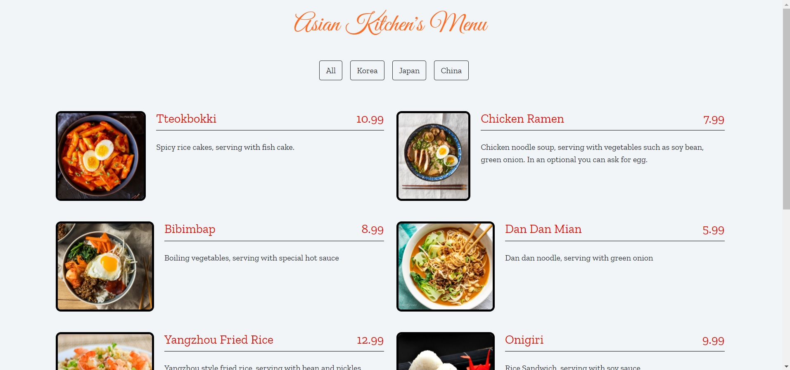

# Kodluyoruz - JavaScript Ödev 3

## [Asian Kitchen's Menu](https://aybarsumur.github.io/kodluyoruz-asian-kitchen/)

Görsel



## About Project
Bu repo, [Kodluyoruz](https://kodluyoruz.org) Front-End Eğitiminde oluşturduğum üçüncü javascript ödevim.

Projemde 3 farklı js dosyası var. Bunlar arasında, index.html dosyasının altındaki script kaynağını değiştirerek geçiş yapabilirsiniz.
Farklar;
app.js de dizide map, set ve filtre kullandım.
app2.js de dizide map, reduce ve filtre kullandım.
app3.js de kendi eklediğin dizi ve filtre kullandım.


## Installation
Projeyi klonlayarak kullanabilirsiniz. 
```
https://github.com/aybarsumur/kodluyoruz-asian-kitchen.git
```